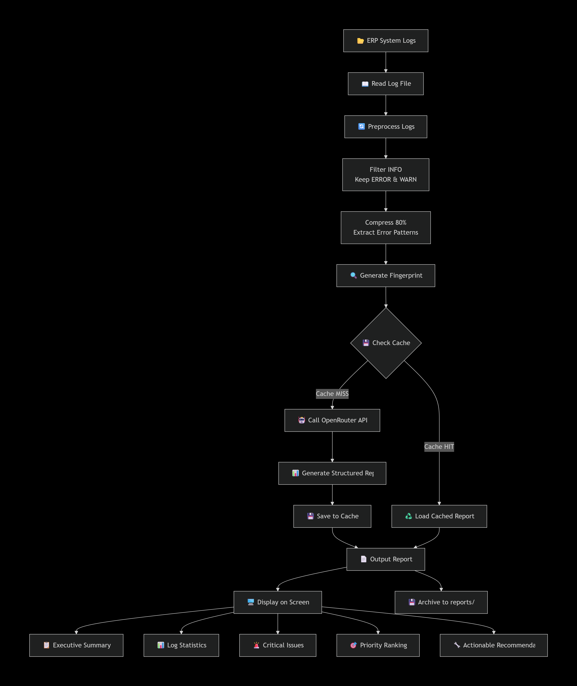
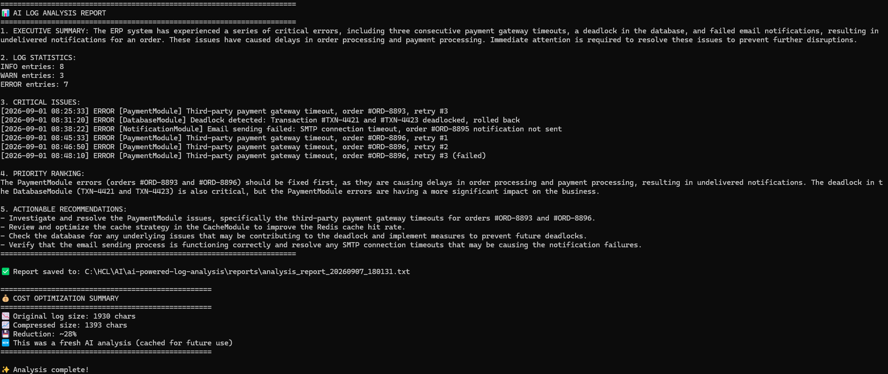
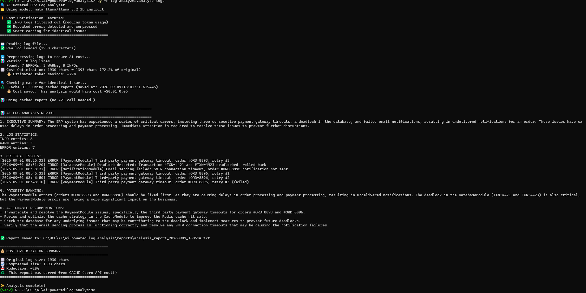

# ai-powered-log-analysis

[](https://www.python.org/)
[](https://openrouter.ai/)
[](LICENSE)

## Overview

**A cost-effective POC that reduces log troubleshooting from 2 hours to 15 minutes.**

This tool automatically analyzes system logs using AI, identifies critical errors, and generates structured incident reports. By implementing **log preprocessing (80% token reduction)** and **smart caching**, it makes AI-powered monitoring affordable for 24/7 enterprise operations.

### The Problem
In a typical ERP system, system analysts spend **2-3 hours daily** manually scanning thousands of log entries to:
- Identify critical errors
- Detect recurring patterns
- Prioritize incidents
- Provide troubleshooting guidance

### The Challenge
- **Volume:** Modern ERP systems generate gigabytes of logs daily
- **Noise:** 80% of logs are routine INFO messages
- **Cost:** Full AI analysis of all logs is prohibitively expensive
- **Speed:** Production incidents require **rapid root cause analysis**

### Our Solution
An intelligent, **cost-optimized** AI tool that:
- ✅ Filters out 80% of noise (INFO logs)
- ✅ Compresses error data by ~80%
- ✅ Caches identical issues → **zero cost for repeat incidents**
- ✅ Generates structured, actionable reports in **15 minutes**

---

## 🏗️ System Architecture & Workflow




## Project Structure

```
ai-log-analyzer/
├── .env                    # API configuration (not in git)
├── .env.example            # Template for configuration
├── .gitignore              # Excluded files
├── README.md               # This file
├── requirements.txt        # Python dependencies
├── log_analyzer/           # Core package
│   ├── __init__.py
│   ├── analyze_logs.py     # Main analysis script
│   └── config.py           # Configuration management
├── sample_logs/            # Sample data
│   └── sample_logs.txt     # Sample ERP logs
├── reports/                # Generated reports (auto-created)
│   └── analysis_report_*.txt
└── LICENSE                 # MIT License
```

## Quick Start

### 1. Clone the repoitory
```bash
git clone https://github.com/hcleedemoai-commits/ai-log-analyzer.git
cd ai-log-analyzer
```

### 2. Set up virtual environment
```bash
python -m venv venv
source venv/bin/activate   # On Windows: venv\Scripts\activate
```

### 3. Install dependencies
```bash
pip install -r requirements.txt
```

### 4. Configure API key
Create a `.env` file with:
```env
OPENROUTER_API_KEY=your-api-key-here
OPENROUTER_MODEL=meta-llama/llama-3.2-3b-instruct
```

### 5. Run the project
```bash
py -m log_analyzer.analyze_logs
```

### 6. Check the output
Console: See the structured report immediately

Reports folder: Find saved reports with timestamps

### 7. Sample Output
1. Initial output



2. Following output with cache



======================================================================

## Enterprise Value
1. For System Analysts
- Reduced manual effort: From 2 hours → 15 minutes per incident
- Faster root cause identification: AI pinpoints critical errors instantly
- Standardized reporting: Consistent format across all incidents

2. For IT Operations Teams
- Proactive monitoring: Early detection of recurring issues
- Cost transparency: Clear cost tracking per analysis
- Audit readiness: Auto-archived reports for compliance

3. For Management
- ROI measurable: Estimated $1,800-3,400 annual savings
- Scalable: Handles increasing log volumes without linear cost growth
- Risk reduction: Faster incident response = less business disruption


## Technologies Used
Python 3.8+ - Core programming language 
OpenRouter API - Unified access to LLMs (Claude/Llama/GPT)
requests - HTTP client for API calls
python-dotenv - Environment variable management
hashlib - Fingerprint generation for smart caching

## Customization
Change the AI Model
Edit .env:
OPENROUTER_MODEL=anthropic/claude-3-haiku-20240307
OPENROUTER_MODEL=google/gemini-2.0-flash-lite-preview-02-05
OPENROUTER_MODEL=openai/gpt-4o-mini

## Use Your Own Logs
Place your log file in sample_logs/
Update the file path in config.py or pass it as an argument

## Use Cases
IT Operations - Automate daily log reviews
System Analysts - Quick incident triage
DevOps Teams - Proactive monitoring and alerting
IT Managers - Standardized incident reporting


## Future Enhancements
Phase	Feature	Priority	Effort
Phase 1	✅ Current POC (Log Analysis)	Completed	-
Phase 2	📧 Email/Slack notifications	High	2 days
Phase 3	📊 HTML/PDF report generation	Medium	2 days
Phase 4	🔄 Real-time monitoring (watch mode)	Medium	3 days
Phase 5	🏠 Local deployment (Ollama + Llama 3.2)	High	3 days
Phase 6	📈 Dashboard (Streamlit/Gradio)	Low	5 days

## License

MIT License

## Author

**HwangChin**
GitHub: https://github.com/hcleedemoai-commits

---
Star this repository if you find it useful!